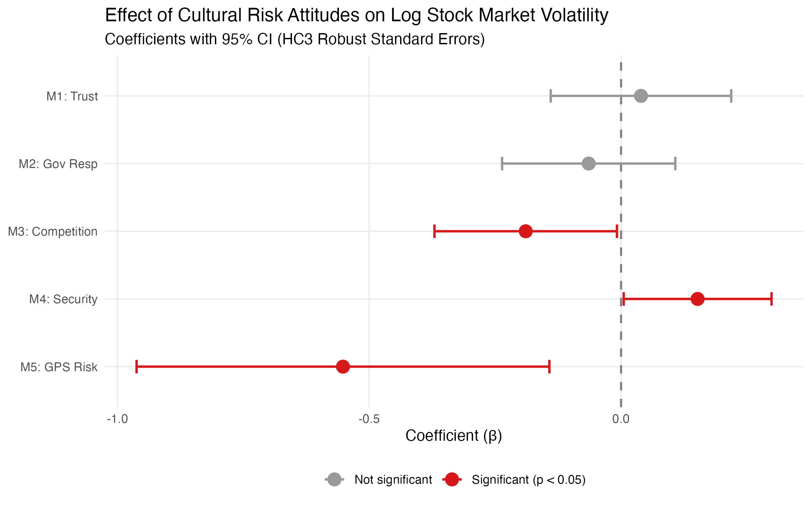

# Cultural Risk Attitudes and Stock Market Volatility

An end-to-end R pipeline that turns individual-level survey microdata (roughly 90,000 World Values Survey respondents) into national risk-attitude profiles. It merges those profiles with experimentally validated preference data (Global Preference Survey) and World Bank financial indicators, and tests whether culture helps explain why some stock markets are more volatile than others.

*Master's thesis (TFM), MSc in Financial Risk Management, ICADE – Universidad Pontificia Comillas, 2026.*

---

## The Problem

Standard explanations of cross-country differences in stock market volatility focus on fundamentals: income level, institutional quality, financial depth and exposure to external shocks. A behavioural view adds a further possibility. If the investors in a country share a common attitude towards risk, that attitude may show up in aggregate market behaviour.

**Research question:** Do nationally prevalent attitudes towards risk predict stock market volatility once GDP per capita and the rule of law are held constant?

Answering this is mainly a **data-integration problem**:

- Risk attitudes are measured at the **individual level**, in surveys that use their own coding conventions, missing-value codes and sampling weights.
- Market volatility and macro controls are measured at the **country level**, in a different source.
- Each source uses a **different country identifier** (ISO numeric, ISO alpha-3 and country names).
- Self-reported survey attitudes (WVS) and incentivised experimental measures (GPS) may not capture the same construct, so their **construct validity** has to be checked before they are compared.

## The Data

| Source | Level | What it provides |
|---|---|---|
| World Values Survey, Wave 6 (2010–2014) | Individual | Four attitudinal risk proxies, demographics, survey weights |
| World Values Survey, Wave 7 (2017–2022) | Individual | Out-of-sample replication (2018 cross-section) |
| Global Preference Survey (Falk et al., 2018) | Country | Experimentally validated risk-taking and trust measures |
| World Bank API (GFDD, WDI, WGI) | Country-year | Stock price volatility (`GFDD.SM.01`), GDP per capita (PPP), rule of law, private credit, trade openness, inflation, bank Z-score, GDP growth |

## The Code

All of the analysis is in a single script, `cultural_risk_volatility.R`. It is organised into numbered sections that run top to bottom. One configuration block at the top holds every file path and parameter, and shared helper functions handle the repeated work (World Bank downloads, HC3 inference, table output). No result is typed in by hand: every coefficient, sample size and percentage effect that the script prints is read from the fitted models.

```
WVS microdata ──► clean & recode ──► weighted country means ──► z-scores ──┐
GPS country file ──────────────────────────────────────────────────────────┼──► ISO3 merge ──► OLS + diagnostics ──► robustness ──► LaTeX tables & figures
World Bank API (volatility, GDP, rule of law, structural controls) ───────┘
```

### 1. Handling missing values

- **Survey non-response.** WVS stores "don't know", "no answer", "not asked" and similar responses as negative codes (`-1` to `-5`). Every raw item is recoded from a negative value to `NA` in a single vectorised step, so that these codes cannot leak into the averages as real values.
- **Item-level availability.** Country means are computed with `na.rm = TRUE`, so each indicator uses every valid answer to that item. A respondent who skipped one question still contributes to the others.
- **No imputation.** Missing values are not imputed at any stage. Countries without a volatility observation or without macro controls are dropped explicitly before estimation, and the resulting sample sizes are printed (WVS models N = 41, GPS model N = 55).
- **Merge audit.** The script reports which countries fail to match across sources, so that no country drops out of the sample without a record.
- **API gaps.** World Bank series are filtered for missing values and blank ISO codes before they are joined, so that aggregate regions (for example "World" or "Euro area") are excluded.

### 2. Standardising metrics

- **Common direction.** All proxies are recoded so that a **higher value means more risk tolerance**. Reverse-scaled items are flipped (for example, pro-competition is `11 − x` on a 1–10 scale), and generalised trust is converted to a binary indicator.
- **Comparable units.** Country-level means are converted to **z-scores**, so that items measured on 0–1, 1–6 and 1–10 scales can be compared directly. A coefficient therefore reads as the effect of a one-standard-deviation difference in national attitudes.
- **Dependent variable.** Volatility is strongly right-skewed (Cyprus during its 2012 banking crisis is the extreme case). The main specification therefore uses **log volatility**, which restores residual normality (verified with Shapiro–Wilk tests) and lets coefficients be read as approximate percentage effects.

### 3. Aggregating the microdata

- Individual responses are collapsed to **survey-weighted national means** with `weighted.mean()` and the official WVS weight variable. This corrects for each national sample's design so that the aggregates represent the national population.
- Demographic composition (mean age, share with higher education, share in the top income bands) is aggregated in the same way, and the number of respondents per country is retained.
- The country-level profiles are then mapped from ISO numeric to ISO alpha-3 codes with `countrycode`, which provides one common key for joining the GPS and World Bank data.

### 4. Modelling and inference

- Five cross-sectional OLS models, one per risk proxy, each controlling for GDP per capita and the rule of law.
- Full diagnostics for every model: VIF (multicollinearity), Breusch–Pagan (heteroskedasticity) and Shapiro–Wilk (normality).
- **HC3 heteroskedasticity-robust standard errors** throughout, which is the conservative choice for small cross-country samples. Both the HC3 standard errors and the matching HC3 p-values are passed to the regression tables, so the significance stars agree with the t-tests.
- To maximise degrees of freedom, the WVS and GPS models are estimated on their own samples. The smaller merged WVS + GPS sample is reported only as a sensitivity check.

### 5. Robustness checks

| Check | Purpose |
|---|---|
| Excluding Cyprus | Rules out a single crisis outlier driving the results |
| Bootstrap percentile CIs (5,000 resamples) | Non-parametric check on the HC3 inference |
| Alternative dependent variables | Bank Z-score, inflation magnitude, GDP growth volatility |
| Additional structural controls | Private credit, trade openness, inflation (market-depth "bad controls" deliberately excluded) |
| OECD vs emerging markets | Sub-sample estimates plus a Chow-style interaction test |
| ΔR² and nested F-tests | Marginal explanatory power of culture beyond fundamentals |
| Minimum detectable effect | Power analysis to separate true nulls from underpowered estimates |
| GDP sensitivity | Tests whether GPS risk is simply a proxy for development |
| Wave 7 replication (2018) | Out-of-sample test, including a balanced same-country comparison |

## The Output

### Tables (LaTeX, written to `output/tables/`)

- `tableC_log_robust_ses.tex`: main results (log volatility, HC3 robust SEs)
- `tableA_log_models.tex`, `tableD_level_robust_ses.tex`: log and level models
- `tableB_cyprus_robustness.tex`: Cyprus-excluded robustness check (log scale, HC3)
- `desc_stats_wvs.tex`, `desc_stats_gps.tex`: descriptive statistics for both samples

### Figures (PNG, written to `output/figures/`)



- GPS risk tolerance against log volatility, coloured by income group
- Pro-competition attitudes against log volatility
- Coefficient plot across all five models (above)
- Correlation heatmap of the risk proxies and volatility

### Key findings (Wave 6, 2012, log volatility, HC3 SEs)

| Model | Risk proxy | β | p-value | N |
|---|---|---|---|---|
| M1 | Social trust (WVS) | +0.040 | 0.658 | 41 |
| M2 | Individual responsibility (WVS) | −0.064 | 0.476 | 41 |
| M3 | Pro-competition (WVS) | −0.189 | 0.048 | 41 |
| M4 | Low security need (WVS) | +0.152 | 0.050 | 41 |
| M5 | Financial risk-taking (GPS) | −0.552 | < 0.05 | 55 |

- Countries with stronger **pro-competition attitudes** have lower volatility. A one-standard-deviation increase corresponds to roughly **17% lower** volatility.
- The incentivised **GPS risk measure** is the most robust predictor. It stays negative and significant when private credit, trade openness and inflation are added individually, and remains significant at the 10% level when all three are added together.
- General trust and attitudes towards individual responsibility show no detectable relationship.

These are cross-sectional associations. They are not causal estimates.

## How to reproduce

1. Clone this repository.
2. Download the raw data (see below) and place the files in `data/raw/`.
3. Install the required packages:
   ```r
   install.packages(c("tidyverse", "moments", "wbstats", "httr", "jsonlite", "haven",
                      "countrycode", "car", "lmtest", "sandwich", "stargazer",
                      "ggrepel", "patchwork", "boot"))
   ```
4. Open R with the repository root as the working directory and run:
   ```r
   source("cultural_risk_volatility.R")
   ```
   The World Bank series are downloaded live, so an internet connection is required. The script stops with a clear message if any raw data file is missing. Tables and figures are written to `output/`, together with `sessionInfo.txt`, which records the package versions used.

## Data availability

> **Disclaimer:** The raw World Values Survey and Global Preference Survey datasets are **not included** in this repository. The files exceed GitHub's file size limits, and both datasets are distributed under their providers' terms of use, which require users to register and download them directly from the original source. To reproduce the analysis, obtain the files below and place them in `data/raw/`:
>
> - WVS Wave 6: `WV6_Data_R_v20201117.rdata` from [worldvaluessurvey.org](https://www.worldvaluessurvey.org/WVSDocumentationWV6.jsp)
> - WVS Wave 7: `WVS_Cross-National_Wave_7_Rdata_v6_0.rdata` from [worldvaluessurvey.org](https://www.worldvaluessurvey.org/WVSDocumentationWV7.jsp)
> - GPS: `country_v11.dta` from the [Global Preference Survey](https://www.briq-institute.org/global-preferences/home)
>
> World Bank indicators are retrieved automatically through the public World Bank API.

## Repository structure

```
├── README.md
├── cultural_risk_volatility.R   # full pipeline
├── figures/                     # selected figures shown in this README
├── data/raw/                    # (not tracked) place raw WVS/GPS files here
└── output/                      # (generated) tables, figures, sessionInfo.txt
```

## Scope and limitations

- The analysis is a cross-section with a small number of countries (41–55), so statistical power is limited. The power analysis quantifies this.
- Wave 7 does not repeat the Wave 6 security item. The M4 replication therefore uses the binary "freedom vs security" question (Q150) as an approximate proxy, recoded so that a higher value still means more risk tolerance.
- World Bank series are downloaded live and can be revised over time, so a rerun may differ slightly from the thesis figures.
- The longitudinal panel analysis reported in Section 4.4.2 of the thesis was run separately and is not included in this repository.
- Results are associations and should not be read as causal effects.

## Tools

R · tidyverse · sandwich / lmtest (robust inference) · boot · stargazer · ggplot2 · World Bank API (`wbstats`, `httr`)

## Author

**Sara Lindlacher Naveira**, MSc Financial Risk Management, ICADE – Universidad Pontificia Comillas - www.linkedin.com/in/sara-lindlacher-naveira
